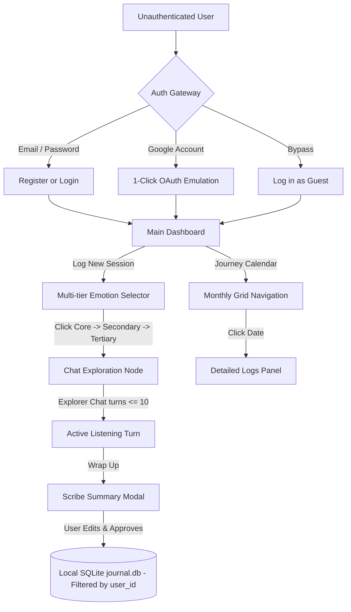

# Product Requirements Document Ver2 – Hearth

## 1. Executive Summary & Product Vision
Hearth is an AI-powered emotional wellness sanctuary designed to help individuals navigate daily stress, catalog emotional trends, and conduct mindful self-reflections. 

By utilizing a coordinated multi-agent workflow (safety gatekeeper, active listener, and scribe), Hearth replaces traditional unstructured logging with an interactive, guided session that culminates in a user-approved, private reflection summary.

---

## 2. Core User Experience & Flows

---

## 3. Detailed Functional Requirements

### 3.1. Authentication Gateway
*   **Req 3.1.1**: The application must enforce an authentication wall. Unauthenticated requests are redirected to the Login/Signup screen.
*   **Req 3.1.2**: Support traditional registration and login using Email and Password.
*   **Req 3.1.3**: Provide a native-feeling "Continue with Google" OAuth button. The modal must simulate Google Identity Services (GIS):
    *   On first sign-in: require Google Email and Password inputs followed by a permissions access consent screen.
    *   Cache successfully authenticated Google accounts in `localStorage`.
    *   On subsequent logins: support **1-click passwordless login** by selecting cached accounts directly from the picker.
*   **Req 3.1.4**: Expose a "Log In as Guest" button allowing instant access under a guest session.

### 3.2. Emotion Selector (List-Based Emotion Wheel)
*   **Req 3.2.1**: Swaps circular wheels for a multi-level vertical selection list spanning the container width.
*   **Req 3.2.2**: The user must drill down through three tiers: Core emotion (e.g., *Bad*) $\rightarrow$ Secondary emotion (e.g., *Stressed*) $\rightarrow$ Tertiary emotion (e.g., *Overwhelmed*).
*   **Req 3.2.3**: Anchored selections must act as breadcrumb indicators. Clicking an anchored emotion header resets the selection back to that specific level.

### 3.3. Conversational Explorer (Active Listening Chat)
*   **Req 3.3.1**: Once logged, the Explorer Agent leads the conversation. The user must be allowed up to 10 turns to reflect on their emotion.
*   **Req 3.3.2**: The Explorer must practice active listening, using short prompts ($\le 15$ words), asking no more than 2 questions per turn, and refraining from proposing solutions or actions.
*   **Req 3.3.3**: Provide a manual "Wrap Up" button in the chat interface to compile the session early.

### 3.4. Scribe Synthesis & Approval Gate
*   **Req 3.4.1**: Upon wrapping up, the Scribe Agent compiles the dialogue history.
*   **Req 3.4.2**: The summary must be written in the **first-person** (as if written by the user), be capped at a maximum of **500 words**, and preserve specific names, events, and contexts.
*   **Req 3.4.3**: Provide a pop-out modal displaying the summary draft inside an editable textarea. The user must be able to modify the summary before clicking "Approve & Save".
*   **Req 3.4.4**: The session must only be committed to the SQLite database (`journal.db`) after explicit user consent.

### 3.5. Monthly Journey Calendar & Details Drawer
*   **Req 3.5.1**: Provide a Monthly Day Grid calendar view.
*   **Req 3.5.2**: Provide pagination headers (`<<`, `<`, `>`, `>>`) to scroll backwards and forwards through months and years of Date records.
*   **Req 3.5.3**: Days containing entries must display colored dot indicators matching the primary emotion logged.
*   **Req 3.5.4**: Clicking on any date must open a details panel displaying a list of all entries recorded on that date, showing timestamps, logged emotion paths, and the final Scribe summaries.

### 3.6. User Log Isolation & Data Privacy
*   **Req 3.6.1**: The SQLite database schema must store a `user_id` text column for all journal entries.
*   **Req 3.6.2**: Restrict GET and POST queries on entries to the currently authenticated user's ID/email to ensure complete log isolation.
*   **Req 3.6.3**: Guest log entries must only be visible within the guest session context, preventing data leakage across profiles.

---

## 4. Multi-Agent Security & Guardrails
*   **Bouncer Agent**: Every user message in the chat must pass through the Bouncer Agent node. The Bouncer checks for prompt injection, off-topic prompts, or harmful input. If flagged, the Bouncer intercepts the turn and returns a blocked status block.
*   **FastAPI Event Filtering**: The server must strip safety check status updates or intermediate validation tokens from streaming chunks, yielding only final node outputs to prevent UI duplicate bubbles.
*   **Secure API Bindings**: The service account running the Cloud Run server must be granted strict Vertex AI User permissions, ensuring credential isolation.

---

## 5. Model Context Protocol (MCP) Interface
*   **Req 5.1**: Expose a local and public FastMCP server.
*   **Req 5.2**: Define standard tools:
    *   `get_latest_journal_entries(user_id: str, limit: int)`: Yields the latest logged reflections and timestamps matching the specific user ID.
    *   `search_entries_by_emotion(emotion: str, user_id: str)`: Filters and returns summaries associated with specific emotions matching the specific user ID.
